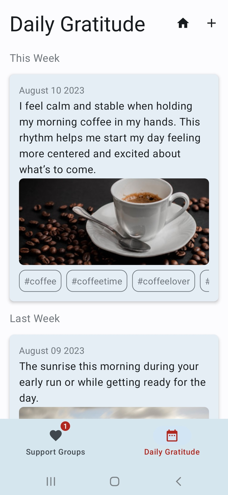
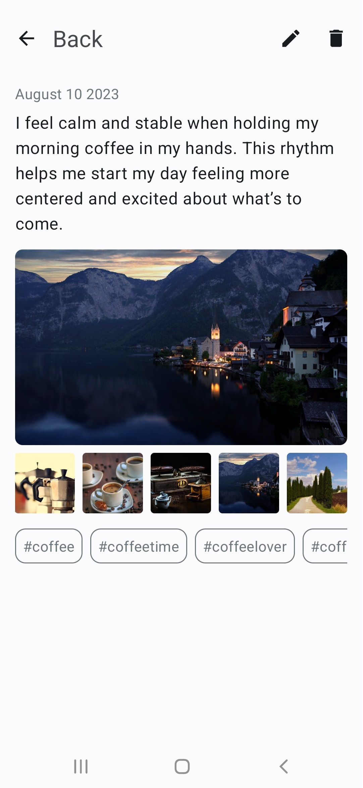
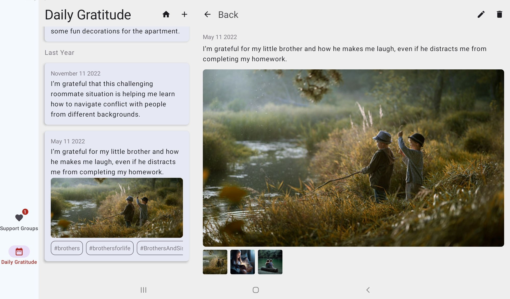
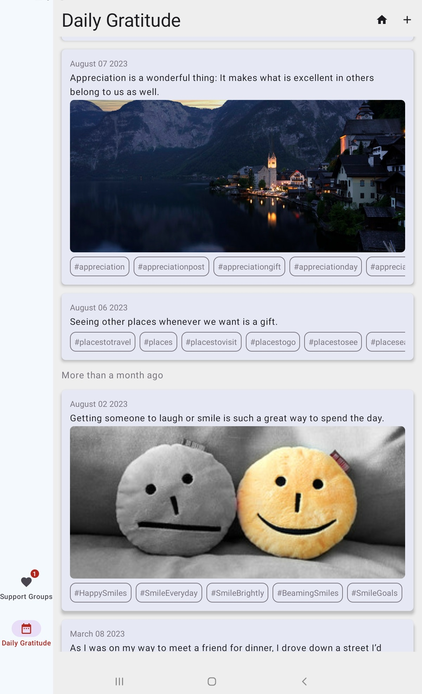

# JournalApp

## App Feature Description

## Overview

The application incorporates Jetpack Compose, Coroutines, and adheres to the MVVM architecture to introduce two core features: the "Daily Gratitude List" and the "Daily Gratitude Details."

## Daily Gratitude List

The "Daily Gratitude List" feature showcases a chronological list of gratitude moments. Each entry comprises the following components:

- **Date:** The date when the gratitude moment was recorded.
- **Entry Summary:** A brief description highlighting the gratitude instance.
- **Optional Photo:** An attached image relevant to the moment.
- **Optional Tags:** Customizable tags for categorization.

The list is organized from the most recent to the least recent gratitude moments. This display ensures straightforward access to recent instances without any grouping applied. The MVVM architecture orchestrates presentation, domain, and data source logic, ensuring a cohesive and structured development approach.

## Daily Gratitude Details

The "Daily Gratitude Details" feature provides an in-depth exploration of individual gratitude moments. It incorporates the following elements:

- **Date:** The recorded date of the gratitude instance.
- **Entry Summary:** An extended description of the gratitude moment.
- **Optional Photo:** A displayed image, if attached.
- **Optional Tags:** Associated tags for context.
- **Multimedia Carousel:** An engaging multimedia carousel enhances the experience, enabling users to navigate through a collection of multimedia content.

Both the "Daily Gratitude List" and "Daily Gratitude Details" screens maintain a minimalist design aesthetic, ensuring a seamless user experience. The adoption of Jetpack Compose facilitates dynamic and responsive UI rendering, Coroutines handle asynchronous tasks for smooth operation, while the MVVM architecture separates UI, business logic, and data layers for codebase maintainability and reusability.

## Conclusion

By combining Jetpack Compose, Coroutines, and the MVVM architecture, the app delivers a seamless and engaging gratitude journal experience. Users can conveniently capture and review moments of gratitude, fostering a positive outlook and overall well-being.

### Images 

    

### Tablet Images 

 
 
  

 
 

